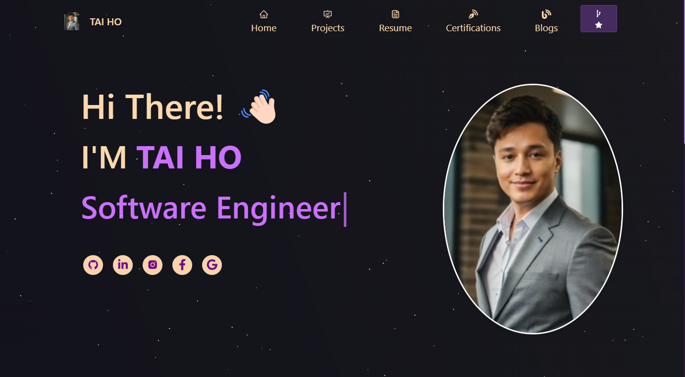
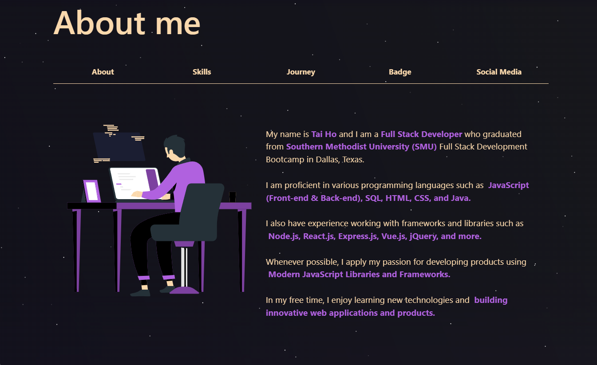
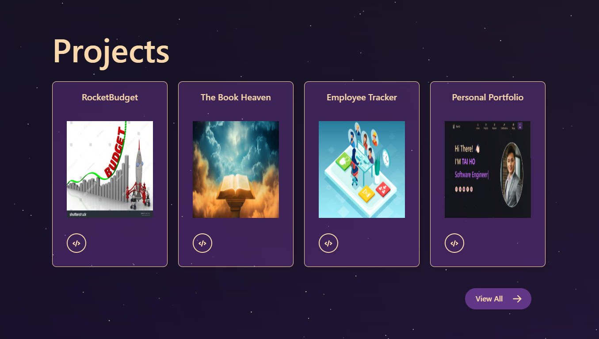
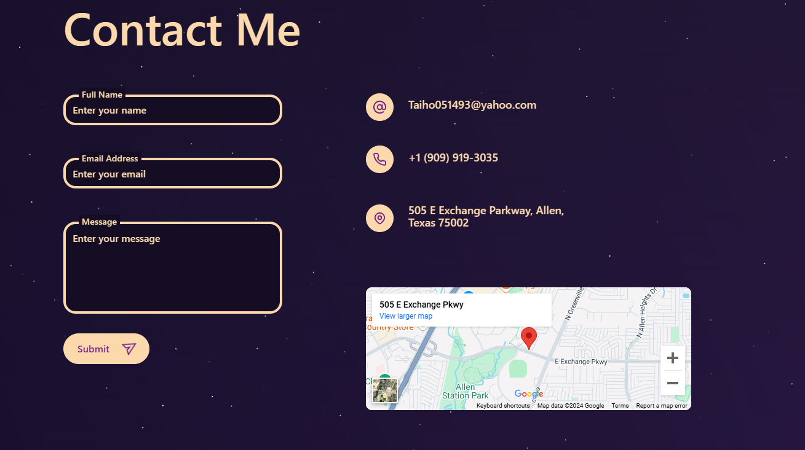

# 🌟 Personal Portfolio

Welcome to **my Personal Portfolio** – a modern, responsive, and visually stunning platform designed to showcase my skills, projects, and achievements. With seamless navigation, animations, and a clean design, this portfolio represents my professional journey and aspirations.

---

## 🌟 Description

I created this **Personal Portfolio** as a representation of my commitment to becoming a skilled software engineer. My goal is to continuously learn, adapt, and grow within the tech industry by embracing new technologies and taking on exciting challenges.

I have always been passionate about coding, and this project is a step toward building a strong professional identity. Through this portfolio, I aim to inspire confidence in my abilities and provide an engaging platform for potential employers, collaborators, and clients to explore my work.

I truly believe that with persistence and a willingness to learn, I can achieve great success in the tech industry and contribute meaningfully to the world of software engineering.

---

## 🌟 Live Demo

Explore the live version of my portfolio at:  
🔗 **[Personal Portfolio Live Demo](https://taiho.netlify.app/)**

---

## 📜 Table of Contents

- [Installation](#installation)
- [Usage](#usage)
- [Screenshots](#screenshots)
- [Tech Stack](#tech-stack)
- [Credits](#credits)
- [License](#license)
- [Badges](#badges)
- [Features](#features)
- [How to Contribute](#how-to-contribute)
- [Tests](#tests)

---

## ⚙️ Installation

Follow these steps to set up the project locally:

1. Clone the repository:
    ```bash
    git clone https://github.com/Justbeingtai/Personal-Portfolio.git
    ```
2. Navigate to the project folder:
    ```bash
    cd Personal-Portfolio
    ```
3. Install dependencies:
    ```bash
    npm install
    ```
4. Start the development server:
    ```bash
    npm start
    ```
5. Open the application in your browser at `http://localhost:3000`.

---

## 🚀 Usage

Explore my portfolio to view:

1. **Home**: A welcoming introduction with animations and interactive particles.
2. **About Me**: Learn more about my educational background, skills, and achievements.
3. **Projects**: Dive into detailed descriptions and images of my most significant work.
4. **Contact Me**: Use the integrated contact form to send inquiries directly to me.

---

## 🖼️ Screenshots

<div align="center">
  <table>
    <tr>
      <td align="center">
        <strong>Homepage</strong><br>
        
      </td>
      <td align="center">
        <strong>About Me</strong><br>
        
      </td>
    </tr>
    <tr>
      <td align="center">
        <strong>Projects</strong><br>
        
      </td>
      <td align="center">
        <strong>Contact Me</strong><br>
        
      </td>
    </tr>
  </table>
</div>

---

## 🛠️ Tech Stack

The Personal Portfolio was built using the following technologies:

### **Frontend**
- [React.js](https://reactjs.org/): For building interactive UI components.
- [Bootstrap](https://getbootstrap.com/): For responsive design.
- [React-Bootstrap](https://react-bootstrap.github.io/): For prebuilt Bootstrap components in React.

### **Animation**
- [React-Reveal](https://www.react-reveal.com/): For animation effects.
- [Lottie](https://lottiefiles.com/): For interactive animations.
- [React-TSParticles](https://github.com/matteobruni/tsparticles): For animated particle effects.

### **Backend**
- [Axios](https://axios-http.com/): For making HTTP requests and handling form submissions.
- [EmailJS](https://www.emailjs.com/): For email integration directly from the frontend.

### **Tools**
- [Visual Studio Code](https://code.visualstudio.com/): Development environment.
- [Git](https://git-scm.com/): Version control.

---

## 👥 Credits

This project is a reflection of my dedication to becoming a professional software engineer.

---

## 📝 License

This project is licensed under the MIT License. For more details, refer to the [LICENSE](LICENSE) file.

---

## 🏅 Badges


---

## 🌟 Features

- **Responsive Design**: Ensures usability across devices.
- **Interactive Animations**: Enhanced user experience with dynamic effects.
- **Portfolio Showcase**: Dedicated sections for projects, skills, and achievements.
- **Contact Form**: Functional form for inquiries integrated with email services.

---

## 🌐 How to Contribute

I welcome contributions to improve my Personal Portfolio. If you’d like to help, follow these steps:

1. Fork the repository.
2. Create a feature branch:
    ```bash
    git checkout -b feature/YourFeature
    ```
3. Commit your changes:
    ```bash
    git commit -m "Add new feature"
    ```
4. Push to your branch:
    ```bash
    git push origin feature/YourFeature
    ```
5. Submit a pull request.

---

## 🧪 Tests

To ensure stability:

1. Install testing dependencies:
    ```bash
    npm install --save-dev jest
    ```
2. Run tests:
    ```bash
    npm test
    ```

---

I am excited about the opportunities this portfolio represents and look forward to growing as a software engineer. Thank you for visiting my portfolio! 🚀
